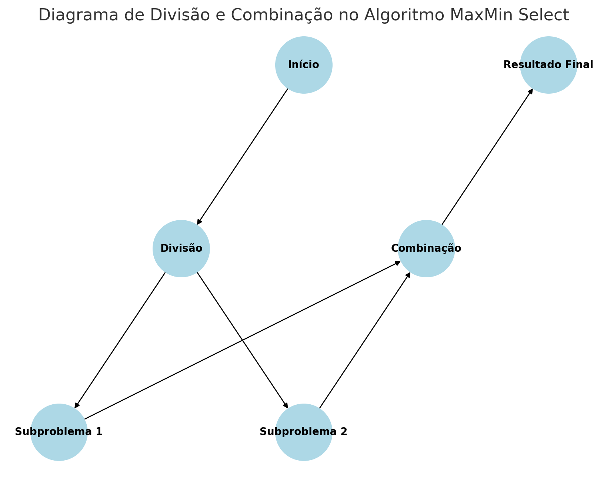

# Implementação do Algoritmo MaxMin Select em Python

## 1. Descrição do Projeto

Este projeto implementa o algoritmo de seleção simultânea do maior e do menor elemento (MaxMin Select) utilizando a técnica de divisão e conquista. A ideia central é dividir a sequência de números em subproblemas menores, resolver cada subproblema recursivamente e, em seguida, combinar os resultados para obter o menor e o maior número de forma eficiente.

### Lógica do Algoritmo

1. **Casos Base:**
   - **Um elemento:** Se o array contém apenas um elemento, ele é considerado tanto o mínimo quanto o máximo.
   - **Dois elementos:** Se o array contém dois elementos, é realizada uma comparação para determinar qual dos dois é o menor e qual é o maior.

2. **Divisão (Divide):**
   - Para arrays com mais de dois elementos, o array é dividido em duas metades.

3. **Conquista (Conquer):**
   - O algoritmo é aplicado recursivamente em cada metade para encontrar o mínimo e o máximo de cada parte.

4. **Combinação (Combine):**
   - Os resultados das duas metades são combinados realizando duas comparações: uma para escolher o menor entre os dois mínimos e outra para escolher o maior entre os dois máximos.

Essa abordagem minimiza o número total de comparações, resultando em uma complexidade de tempo linear, **O(n)**.

## 2. Como Executar o Projeto

1. **Pré-requisitos:**
   - Python 3 instalado no sistema.

2. **Passos:**
   - Clone o repositório do GitHub.
   - Abra o terminal e navegue até o diretório do projeto.
   - Execute o seguinte comando:
     ```bash
     python3 main.py
     ```
3. **Saída Esperada:**
   - O programa exibirá o menor e o maior número da sequência de entrada do usuário.

## 3. Relatório Técnico

### 3.1 Análise da Complexidade Assintótica pelo Método de Contagem de Operações

- **Caso com 1 elemento:** Nenhuma comparação é realizada.
- **Caso com 2 elementos:** Realiza 1 comparação para definir o menor e o maior.
- **Combinação dos resultados:** Em cada chamada recursiva (exceto nos casos base), são realizadas 2 comparações para combinar os resultados das sublistas.

A recorrência que descreve o número total de comparações é:

```T(n) = 2T(n/2) + 2 (para n > 2) ```

com T(1) = 0 e T(2) = 1.

Essa recorrência tem solução linear, ou seja, **T(n) ∈ O(n)**, o que comprova a eficiência do algoritmo.

### 3.2 Análise da Complexidade pelo Teorema Mestre

Considerando a recorrência:

```T(n) = 2T(n/2) + O(1)```

1. **Identificação dos parâmetros:**
   - **a = 2:** São gerados 2 subproblemas.
   - **b = 2:** Cada subproblema tem tamanho n/2.
   - **f(n) = O(1):** Custo constante para combinar os resultados.

2. **Cálculo de log_b(a):**
   - log₂(2) = 1.

3. **Comparação de f(n) com n^(log_b(a)):**
   - n^(log_b(a)) = n.
   - Como f(n) = O(1), temos que f(n) ∈ O(n^(1-ε)) para ε = 1.

4. **Aplicação do Teorema Mestre:**
   - Estamos no **Caso 1**, onde f(n) é polinomialmente menor que n^(log_b(a)).
  
5. **Solução Assintótica:**
   - Assim, T(n) ∈ Θ(n).

## 4. Diagrama Visual (Ponto Extra)

Um diagrama ilustrativo da divisão e combinação no algoritmo foi desenvolvido para mostrar:
- Como o problema original é dividido em subproblemas.
- A forma de combinação dos resultados para obter os valores final de mínimo e máximo.
- Os níveis da árvore de recursão e o número de comparações realizadas em cada nível.

### 4.1 Explicação do Diagrama

O diagrama a seguir ilustra o processo de divisão e combinação no algoritmo MaxMin Select:

- **Divisão:** O algoritmo divide a sequência original em dois subproblemas menores.
- **Subproblema 1 e Subproblema 2:** Cada subproblema é resolvido recursivamente para encontrar o mínimo e o máximo.
- **Combinação:** Depois que os subproblemas são resolvidos, os resultados são combinados, realizando duas comparações: uma para selecionar o menor entre os dois mínimos e outra para escolher o maior entre os dois máximos.
- **Resultado Final:** O valor final do mínimo e do máximo é obtido após a combinação.

### Diagrama:




### Desenvolvido por: Alberto da Costa Reis Júnior